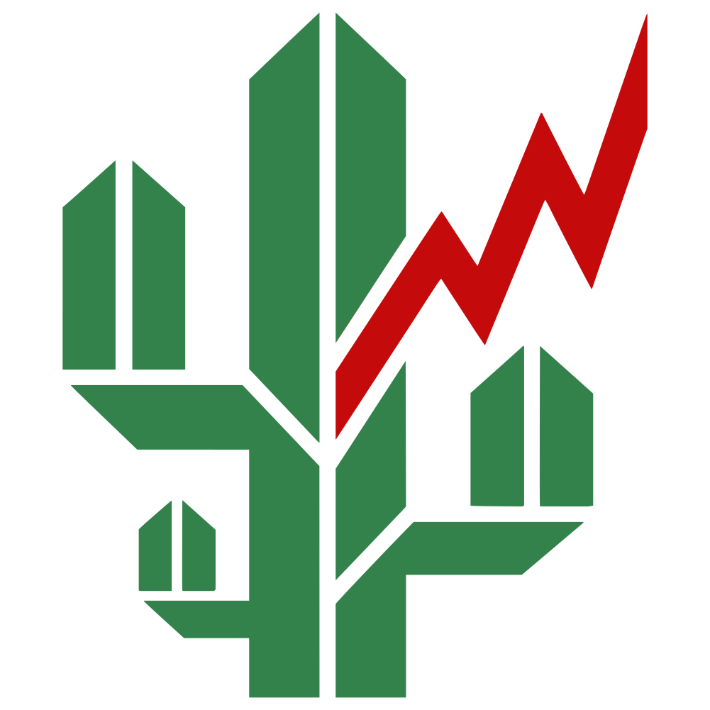

<div align="center">
  
  <br><br>
  <i>"O real não está no início nem no fim, ele se mostra pra gente é no meio da travessia."</i>
  <br>
  <sub>ROSA, João Guimarães. <i>Grande sertão: veredas</i>. 19. ed. Rio de Janeiro: Nova Fronteira, 1986.</sub>
  <br><br>
  
</div>

<br>

# veredas de papel

<div align="center">

[](https://github.com/ffreitasb/veredas-de-papel/actions/workflows/ci.yml)
[](https://python.org)
[](https://www.gnu.org/licenses/gpl-3.0)
[](https://github.com/ffreitasb/veredas-de-papel/releases)
[](https://github.com/astral-sh/ruff)
[](https://github.com/astral-sh/uv)
[](https://github.com/ffreitasb/veredas-de-papel)

[](https://dadosabertos.bcb.gov.br)
[](https://fastapi.tiangolo.com)
[](https://htmx.org)
[](https://pandas.pydata.org)
[](https://github.com/ffreitasb/veredas-de-papel#%EF%B8%8F-disclaimer)

</div>

Monitor de taxas de CDB e detecção de anomalias no mercado de renda fixa brasileiro.

## Sobre o Nome

Inspirado na obra-prima de Guimarães Rosa, *Grande Sertão: Veredas*, o nome reconhece que o mercado financeiro brasileiro é um território hostil, vasto e traiçoeiro. Como dizia o jagunço Riobaldo: *"Viver é muito perigoso"*. Investir também é.

- **Vereda**: No sertão, é um oásis em meio à secura. No contexto deste software, representa o *atalho que instituições financeiras em dificuldade tomam* ao oferecer taxas muito acima do mercado.
- **De Papel**: CDBs são "papéis", mas a expressão carrega o peso da fragilidade. A "vereda de papel" é um caminho sem chão firme.

## O Problema

O caso do Banco Master/Will Bank (2025) demonstrou que taxas extremamente atrativas (ex: 120–185% CDI, IPCA+30%) muitas vezes funcionam como sinais claros de risco ignorados por investidores seduzidos pela alta rentabilidade. O banco oferecia retornos fora da curva porque estava desesperado por liquidez — um padrão histórico que se repetiu em casos clássicos como BVA (2014) e Cruzeiro do Sul (2012).

## A Solução

**veredas de papel** é uma ferramenta open-source (FOSS) que:

1. **Monitora** o mercado de renda fixa com dados macroeconômicos do Banco Central e indicadores prudenciais oficiais das IFs (IFData/Banco Central).
2. **Detecta** anomalias e padrões de risco através de um motor robusto que combina Regras Determinísticas, Modelos Estatísticos e Machine Learning.
3. **Visualiza** o cenário de forma limpa e objetiva através de um Dashboard Web com filtros, ordenação e exportação CSV.
4. **Alerta** via Telegram e Email quando anomalias críticas são detectadas.

---

## 🚀 Instalação

### Pré-requisitos

- **Python 3.11 ou superior**
- Git

### Com uv (recomendado)

[uv](https://docs.astral.sh/uv/) gerencia Python, venv e dependências em um único comando, sem etapas manuais.

```bash
# Instalar uv (se ainda não tiver)
# macOS / Linux
curl -LsSf https://astral.sh/uv/install.sh | sh

# Windows (PowerShell)
powershell -ExecutionPolicy ByPass -c "irm https://astral.sh/uv/install.ps1 | iex"

# Clonar e configurar
git clone https://github.com/ffreitasb/veredas-de-papel.git
cd veredas-de-papel

# Criar venv e instalar todas as dependências em um passo
uv sync --extra dev --extra web --extra ml --extra alerts
```

### Com pip e venv (alternativa clássica)

```bash
git clone https://github.com/ffreitasb/veredas-de-papel.git
cd veredas-de-papel

# Linux / macOS
python -m venv .venv && source .venv/bin/activate

# Windows
python -m venv .venv && .venv\Scripts\activate

pip install -e ".[dev,web,ml,alerts]"
```

### Dependências opcionais

| Grupo | Conteúdo |
|-------|----------|
| `dev` | pytest, ruff, mypy |
| `web` | FastAPI, Jinja2, uvicorn |
| `ml` | scikit-learn (Isolation Forest, DBSCAN) |
| `alerts` | Telegram Bot, Email SMTP |
| `scrapers` | Playwright, BeautifulSoup4 (coleta de corretoras) |

Instale apenas o que precisar:
```bash
# uv
uv sync --extra web --extra ml

# com scrapers de corretoras
uv sync --extra web --extra scrapers

# pip
pip install -e ".[web,ml]"
```

### Configuração

```bash
cp .env.example .env
```

Para uso local (SQLite), as configurações padrão são suficientes. Para alertas, adicione ao `.env`:

```env
# Telegram
VEREDAS_TELEGRAM_BOT_TOKEN=seu_token_aqui
VEREDAS_TELEGRAM_CHAT_ID=seu_chat_id_aqui

# Email (SMTP)
VEREDAS_SMTP_HOST=smtp.gmail.com
VEREDAS_SMTP_PORT=587
VEREDAS_SMTP_USER=seu@email.com
VEREDAS_SMTP_PASSWORD=sua_senha_app
VEREDAS_ALERT_EMAIL_TO=destinatario@email.com
```

### Inicializar o banco de dados

```bash
veredas init
```

Cria o esquema SQLite via Alembic (migrações versionadas) em `data/veredas.db`.

---

## 💻 Como Usar

### Fluxo Básico de Operação

**1. Coletar dados macroeconômicos:**
```bash
veredas collect bcb
```
Sincroniza Selic, CDI e IPCA da API pública do Banco Central.

**2. Coletar indicadores de saúde das IFs:**
```bash
veredas collect ifdata
```
Importa Índice de Basileia, Liquidez e ROA/ROE do portal IFData do Banco Central.

**3. Coletar taxas de corretoras (novo em v0.2):**
```bash
veredas collect scrapers --fonte xp
veredas collect scrapers --fonte btg
veredas collect scrapers --fonte inter
veredas collect scrapers --fonte rico
```
Coleta taxas de CDB diretamente das prateleiras públicas das corretoras via scraping.

**4. Executar o motor de análise:**
```bash
veredas analyze
```
Avalia os dados com regras determinísticas, Z-Score rolling, Isolation Forest e detectores de saúde financeira.

**4. Iniciar o dashboard web:**
```bash
veredas web
# ou com hot-reload para desenvolvimento
veredas web --reload
```
Acesse: [http://localhost:8000](http://localhost:8000)

### Comandos da CLI

| Comando | Descrição |
|---------|-----------|
| `veredas init` | Cria/atualiza o esquema do banco via Alembic |
| `veredas collect bcb` | Sincroniza dados históricos com o Banco Central |
| `veredas collect ifdata` | Importa indicadores prudenciais das IFs do IFData |
| `veredas collect scrapers --fonte xp\|btg\|inter\|rico` | Coleta taxas das prateleiras públicas das corretoras |
| `veredas analyze` | Executa o pipeline completo de detecção de anomalias |
| `veredas analyze --ml` | Inclui detectores de Machine Learning na análise |
| `veredas web` | Inicia o dashboard web (padrão: `localhost:8000`) |
| `veredas detectors` | Lista todos os algoritmos de detecção registrados |
| `veredas status` | Exibe integridade do banco e taxas atuais |
| `veredas alerts status` | Mostra os canais de alerta configurados |
| `veredas alerts test` | Envia mensagem de teste pelos canais configurados |

---

## 🌐 Dashboard Web

O dashboard oferece visualização interativa com atualizações parciais via HTMX (sem recarregar a página inteira).

| Rota | Conteúdo |
|------|----------|
| `/` | Resumo geral: totais, anomalias críticas, alertas recentes |
| `/taxas/` | Tabela de taxas de CDB com filtros e ordenação por coluna |
| `/anomalias/` | Lista de anomalias com filtros por severidade, tipo e IF |
| `/instituicoes/` | Lista de instituições financeiras monitoradas |
| `/instituicoes/{cnpj}` | Perfil completo da IF com histórico de saúde financeira trimestral |

### Exportação CSV

Todas as listagens possuem botão **↓ CSV** que gera arquivos compatíveis com Excel brasileiro (UTF-8-BOM, delimitador `;`):

- `/taxas/export.csv` — até 10.000 registros com os filtros ativos
- `/anomalias/export.csv` — até 10.000 anomalias com os filtros ativos

---

## 🧠 Motor de Detecção

### Regras Determinísticas

| Tipo | Condição | Severidade |
|------|----------|------------|
| `SPREAD_ALTO` | CDB > 130% CDI (ajustado por tier do emissor) | HIGH |
| `SPREAD_CRITICO` | CDB > 150% CDI | CRITICAL |
| `SALTO_BRUSCO` | Alta > 10 pp em 7 dias | MEDIUM |
| `SALTO_EXTREMO` | Alta > 20 pp em 7 dias | HIGH |
| `QUEDA_BRUSCA` | Queda > 10 pp em 7 dias | LOW |
| `QUEDA_EXTREMA` | Queda > 20 pp em 7 dias | MEDIUM |

### Estatística

| Tipo | Método |
|------|--------|
| `DIVERGENCIA` / `DIVERGENCIA_EXTREMA` | Z-Score rolling (2σ / 3σ acima da média de mercado) |
| `CHANGE_POINT` | Detecção de quebra estrutural via PELT (ruptures) |

### Machine Learning

| Tipo | Método | Precondição |
|------|--------|-------------|
| `ISOLATION_ANOMALY` | Isolation Forest multivariável (Taxa, Prazo, Risco) | ≥ 30 amostras |
| `CLUSTER_OUTLIER` | DBSCAN — IFs sem cluster de densidade | ≥ 200 emissores únicos |

> **Votação cross-category (ENG-01):** quando detectores de *categorias diferentes* (regras + estatística + ML) concordam sobre a mesma taxa, a severidade é elevada automaticamente: 2 categorias → +1 nível, 3 categorias → +2 níveis.

### Saúde Financeira (IFData)

| Tipo | Condição | Severidade |
|------|----------|------------|
| `BASILEIA_BAIXO` | Basileia < 11% **e** taxa CDI > 120% | HIGH |
| `BASILEIA_BAIXO` | Basileia < 9% **e** taxa CDI > 120% | CRITICAL |
| `LIQUIDEZ_CRITICA` | Liquidez < 110% **e** taxa CDI > 115% | HIGH |
| `LIQUIDEZ_CRITICA` | Liquidez < 100% **e** taxa CDI > 115% | CRITICAL |

---

## 🗺️ Roadmap

Versão atual: **[v0.2.0-alpha](https://github.com/ffreitasb/veredas-de-papel/releases/tag/v0.2.0-alpha)** — veja o [ROADMAP.md](ROADMAP.md) para o detalhamento completo de cada fase.

- [x] **Fase 1 (MVP)**: Estrutura base, CLI, integração BCB, núcleo de detecção (Regras, Estatística, ML).
- [x] **Fase 2**: Dashboard web (FastAPI + Jinja2 + HTMX) para análise visual.
- [x] **Fase 3**: Coletor IFData — cruzamento de taxas altas com saúde financeira oficial (Basileia, Liquidez, ROA/ROE).
- [x] **Fase B**: Suite de testes, migrações Alembic, sistema de alertas (Telegram/Email), CSV export, filtros e ordenação no dashboard.
- [x] **Fase C**: GitHub Actions CI (tests × Python 3.11/3.12, lint, types).
- [x] **Fase 4.1**: Fundação de scrapers (WebCollectorBase, Playwright, normalização).
- [x] **Fase 4.2**: Corretoras — prateleiras públicas (XP, BTG, Inter, Rico).
- [ ] **Fase 4.3**: B3: mercado secundário *(em andamento — downloader/parser prontos, collector pendente)*
- [ ] **Fase 4.4**: Inteligência cruzada entre fontes (detecção multi-origem).
- [ ] **Fase 5**: Dados alternativos (Reclame Aqui, Processos Sancionadores BCB).
- [ ] **Fase D**: Distribuição (PyInstaller, PyPI, demo público).

---

## 🛠️ Desenvolvimento

### Com uv

```bash
# Instalar dependências de dev
uv sync --extra dev --extra web --extra ml --extra alerts

# Testes
uv run pytest

# Lint e formatação
uv run ruff check src/
uv run ruff format src/

# Checagem de tipagem
uv run mypy src/

# Migrações de banco (Alembic)
uv run python -m alembic upgrade head
uv run python -m alembic revision --autogenerate -m "descricao"
```

### Com pip/venv

```bash
# Testes
pytest

# Lint e formatação
ruff check src/
ruff format src/

# Checagem de tipagem
mypy src/

# Migrações de banco (Alembic)
python -m alembic upgrade head
python -m alembic revision --autogenerate -m "descricao"
python -m alembic history
```

## 📖 Documentação

Para um guia completo voltado a usuários não-técnicos — desde a instalação passo a passo até o uso de cada comando, configuração de alertas, FAQ e solução de problemas — consulte o **[Guia do Usuário](USER_GUIDE.md)**.

Para entender por que este projeto é inédito no ecossistema FOSS brasileiro — incluindo o mapeamento do que existe (e do que não existe) em bibliotecas Python, fontes de dados de CDB e comparação direta com o Yubb — veja **[DIFERENCIAIS.md](DIFERENCIAIS.md)**.

## 🤝 Contribuindo

Sinta-se à vontade para abrir *Issues* relatando bugs ou sugerindo features. Se quiser colocar a mão na massa, faça um Fork do projeto, crie uma branch e envie seu *Pull Request*.

Nosso objetivo primário é fornecer inteligência de dados transparente para o investidor brasileiro.

## 📄 Licença

Distribuído sob a licença **GPL-3.0-or-later**. Veja o arquivo `pyproject.toml` para mais informações.

## ⚠️ Disclaimer

**Este software tem caráter puramente educacional e analítico.**
Não constitui, de forma alguma, recomendação de investimento, compra, venda ou retenção de ativos financeiros. Os dados processados podem conter atrasos, distorções ou incorreções inerentes às fontes públicas. Sempre consulte um profissional certificado e faça sua própria diligência antes de investir.

---

*Desenvolvido com ☕, Python e preocupação legítima com o investidor brasileiro.*
